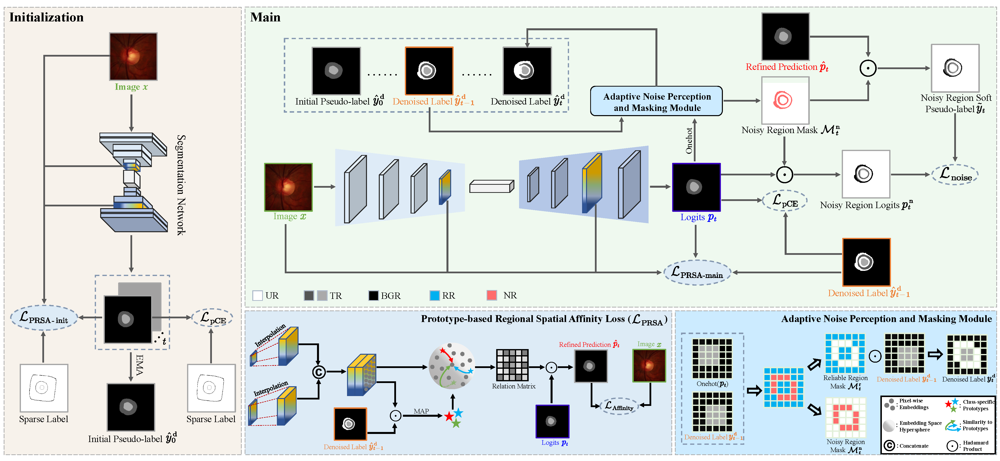
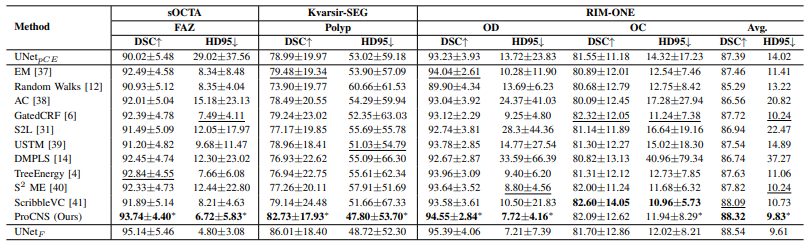

# ProCNS: Progressive Prototype Calibration and Noise Suppression for Weakly-Supervised Medical Image Segmentation
The official implementation of the paper: [**ProCNS: Progressive Prototype Calibration and Noise Suppression for Weakly-Supervised Medical Image Segmentation**](https://arxiv.org/abs/2401.14074)


# 🔔News
- 2024-12-23, 🎉🎉 Our paper "[**ProCNS: Progressive Prototype Calibration and Noise Suppression for Weakly-Supervised Medical Image Segmentation**](https://arxiv.org/abs/2401.14074)" has been accepted by **IEEE Journal of Biomedical and Health Informatics (JBHI)**.
  

# Datasets
## Download the Processed Datasets

<table>
  <tbody>
    <tr>
      <td align="center"><i>Modality</i></td>
      <td align="center">Fundus</td>
      <td align="center">OCTA</td>
      <td align="center">Endoscopy</td>
      <td align="center">Cardiac MRI</td>
      <td align="center">Brain Tumor MRI</td>
      <td align="center">H\&E</td>
    </tr>
    <tr>
      <td align="center"><i>Sparse Annotation Format</i></td>
      <td align="center">scribble</td>
      <td align="center">point</td>
      <td align="center">block</td>
      <td align="center">scribble</td>
      <td align="center">block</td>
      <td align="center">point</td>
    </tr>
    <tr>
      <td align="center"><i>Source</i></td>
      <td align="center"><a href="https://drive.google.com/drive/folders/1tCed5NFJoEZgW2dT2nyEWSbU9-ihY7EO">Download</a></td> 
      <td align="center"><a href="https://drive.google.com/drive/folders/13UZ0XdOba0Mi7q60a6cp-I4gj-uENnbj">Download</a></td>  
      <td align="center"><a href="https://drive.google.com/drive/folders/16keFJ_qpg4G1MJMDPdejSB6FZe_xYbM2">Download</a></td>  
      <td align="center"><a href="https://github.com/HiLab-git/WSL4MIS/tree/main/data/ACDC">Download</a></td> 
      <td align="center"><a href="https://www.kaggle.com/datasets/debobratachakraborty/brats2019-dataset">Download</a></td>  
      <td align="center"><a href="https://ieeexplore.ieee.org/abstract/document/7872382">Paper</a></td>  
    </tr>
    <tr>
      <td align="center"><i>Processed (.h5)</i></td>
      <td align="center"><a href="https://github.com/LyxDLiI/ProCNS/tree/main/data">Download</a></td> 
      <td align="center"><a href="https://github.com/LyxDLiI/ProCNS/tree/main/data">Download</a></td>  
      <td align="center"><a href="https://github.com/LyxDLiI/ProCNS/tree/main/data">Download</a></td> 
      <td align="center"><a href="https://github.com/HiLab-git/WSL4MIS/tree/main/data/ACDC">Download</a></td> 
      <td align="center"><a>N/A</a></td>  
      <td align="center"><a>N/A</a></td>  
    </tr>

  </tbody>
</table>
N/A will be included in subsequent updates.

# Requirements
Some important required packages are listed below:
* Pytorch 1.10.2
* cudatoolkit 11.3.1
* efficientnet-pytorch 0.7.1
* tensorboardx 2.5.1
* medpy 0.4.0
* scikit-image 0.19.3
* simpleitk  2.1.1.2
* Python >= 3.9
# Usage
## 1. Clone this project
``` bash
git clone https://github.com/LyxDLiI/ProCNS.git
cd ProCNS/code
```

## 2. Create a conda environment
``` bash
conda env create -n procns -f procns.yaml
conda activate procns
pip install tree_filter-0.1-cp39-cp39-linux_x86_64.whl
```
## 3. Pre-processing
Data preprocessing includes normalizing all image intensities to between 0 and 1, while data augmentation includes randomly flipping images horizontally and vertically as well as rotation (spanning from -45° to 45°).

## 4. Train the model
``` bash 
bash run.sh
```

## 5. Test the model
``` bash
bash test.sh
```
## 6. Result
<div style="text-align: center;">
  
</div>

## 7. Visualization
<div>
  
</div>

# Acknowledgement
* [WSL4MIS](https://github.com/HiLab-git/WSL4MIS)
* [FedICRA](https://github.com/llmir/FedICRA)
* [FedLPPA](https://github.com/llmir/FedLPPA)

# Citation
If you find FedLPPA useful in your research, please consider citing:
```
@article{liu2024procns,
  title={ProCNS: Progressive Prototype Calibration and Noise Suppression for Weakly-Supervised Medical Image Segmentation},
  author={Liu, Y and Lin, L and Wong, KKY and Tang, X},
  journal={arXiv preprint arXiv:2401.14074},
  year={2024}
}
```
If you have any questions, please feel free to contact us.


